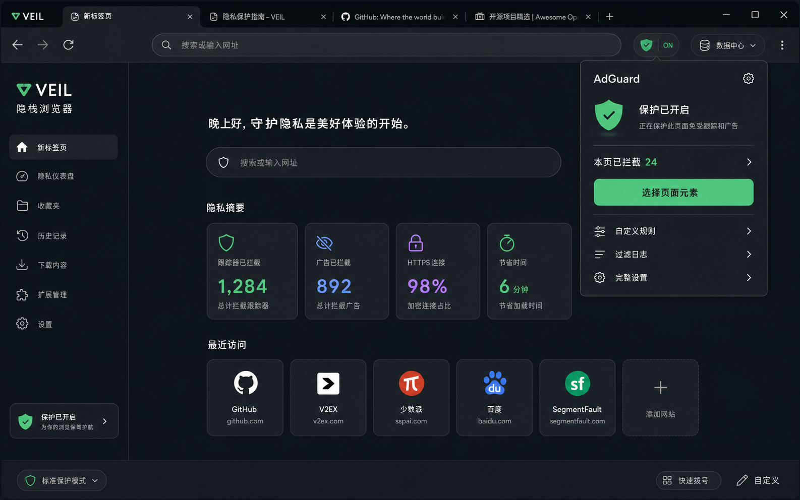
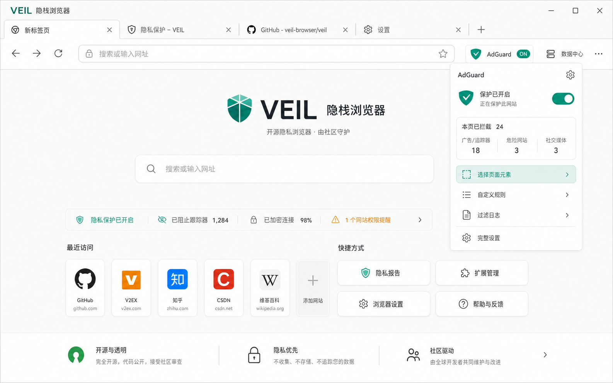
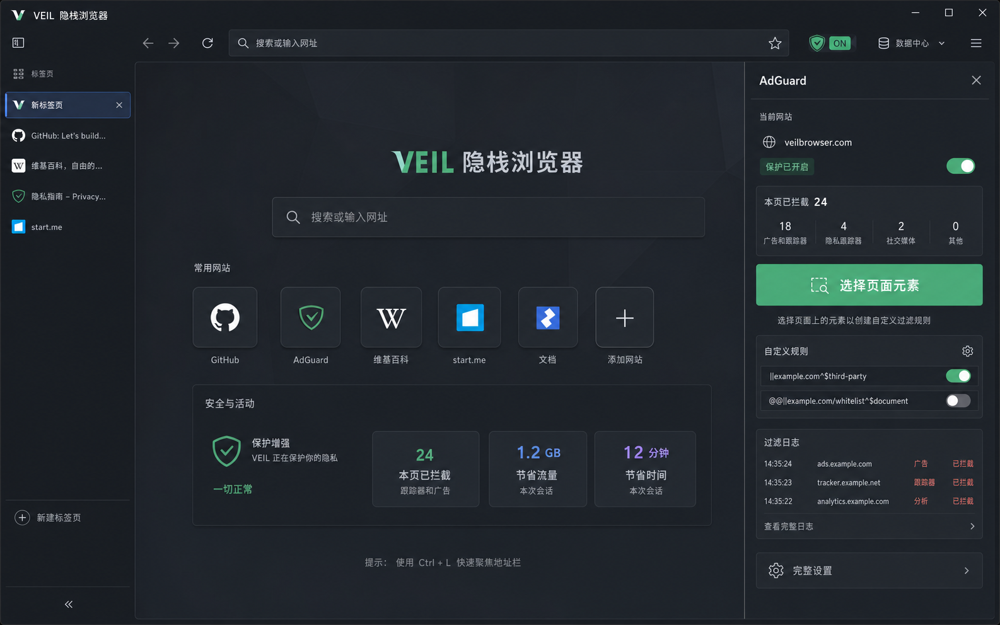
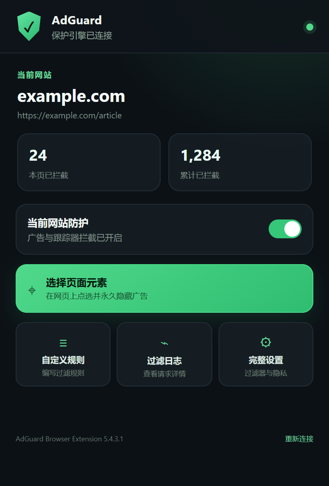

# VeilBrowser 隐栈浏览器

[](LICENSE)


[](https://github.com/myHearDe/VeilBrowser/actions/workflows/build.yml)

一款面向 Windows 10/11 x64 的本地隐私浏览器原型。界面使用 C# / WPF，
网页内核使用 Microsoft Edge WebView2（Chromium），项目面向
Visual Studio 2026 与 .NET 10 LTS。

## 核心加密保护

VeilBrowser 的主要优势是对关闭状态下的浏览器本地资料进行整体加密保护。
正常关闭或安全锁定后，浏览历史、收藏夹、密码保险库、下载记录、会话和设置，
以及 WebView2 Profile 中的 Cookie、LocalStorage、IndexedDB、缓存、站点权限和
AdGuard 配置，都会进入经过认证的 AES-256-GCM 加密文件；实际下载到普通文件夹的
文件不在该范围内。

程序使用密码学安全随机数生成独立的 256 位数据主密钥，并为浏览器状态、Profile
容器和主密钥包裹派生不同的用途子密钥。Profile 采用分块 AES-GCM v2，每个数据块
和容器结束位置都经过完整性认证，因此直接复制、修改、拼接或截断加密文件，不能
直接得到有效明文，也难以在不被发现的情况下篡改数据。

启用主密码和“启动时要求主密码”后，主密码通过 Argon2id（64 MiB 内存、4 次迭代）
派生解锁密钥，再用于加密随机主密钥。配合足够长、唯一且不可预测的主密码，攻击者
即使复制了整个 VeilBrowser 数据目录，也只能进行成本较高的离线密码猜测；AES-256-GCM
本身目前没有现实可行的直接破解方式。不设置主密码时，主密钥仍由 Windows DPAPI
`CurrentUser` 保护，复制到其他电脑或其他 Windows 账户通常无法解密。

该保护有明确边界：浏览器解锁运行期间，WebView2 必须使用受目录权限保护的明文工作
Profile；断电、强制结束或加密失败也可能暂时留下该目录。同一 Windows 账户下的恶意
程序、管理员、进程内存读取、键盘或剪贴板监控，以及 Windows 页面文件、休眠文件和
备份中的系统级残留，不属于本地加密容器能够完全阻止的范围。建议使用强主密码、开启
启动锁并始终正常关闭浏览器；此时关闭状态下被复制的数据具有较强的离线保密能力。

**Keywords:** privacy browser, encrypted browser data, WPF browser,
WebView2 browser, tabbed browser, AdGuard, Windows desktop, C#, .NET 10.

0.4.0 相对 0.3.0 的完整变化见 [`CHANGELOG.md`](CHANGELOG.md)。

## 界面预览

### 午夜翡翠



### 瓷白日光



### 石墨专注



### AdGuard 控制中心



## 当前版本能做什么

- 0.4.0 提供“午夜翡翠、瓷白日光、石墨专注”三套完整界面风格，可在设置中
  持久化切换；石墨专注会同时切换为适合大量页面的垂直标签栏。
- 内置三主题新标签页，统一搜索、常用网站、隐私状态与本地加密提示。
- 迁移到 Edge WebView2，支持主流 H.264/AAC 视频、系统媒体解码和更完整的网站兼容性。
- 默认内置官方 AdGuard Browser Extension 5.4.3.1（Manifest V3）。
- 右上角 AdGuard 盾牌打开 VeilBrowser 专用控制中心，不再把工具栏弹窗错误地
  当普通网页加载；支持当前网站开关、拦截统计和“选择页面元素”手动屏蔽。
- 旁边菜单支持全局启停、自定义过滤规则、过滤日志和 AdGuard 完整设置。
- 支持 AdGuard 广告/跟踪器拦截、过滤器订阅、白名单、用户规则、
  页面元素拦截、统计和配置导入导出等扩展自身能力。
- 多标签页、地址栏搜索、前进、后退、刷新、主页。
- 网页弹窗和右键“新窗口打开”统一进入当前窗口的新标签页。
- 标签页右键支持复制、关闭其他、关闭右侧；支持恢复关闭的标签页和 Ctrl+Tab 切换。
- 支持 F11/网页视频全屏、Ctrl+H 历史、Ctrl+J 下载、Ctrl+P 打印及常用导航快捷键。
- 下载、打开已下载文件、打印、页面查找、缩放、开发者工具。
- 浏览历史、下载记录、书签、密码保险库、会话记录。
- 可选启动主锁；历史、下载、书签、密码、Cookie/网站数据、会话、
  自动填充和设置入口可分别决定是否再次验证。
- 主密码使用 Argon2id（64 MiB、4 次迭代）派生解锁密钥。
- 浏览器实际数据使用独立随机 256 位主密钥。
- 主密钥由 AES-256-GCM 包裹；敏感状态使用 AES-256-GCM 加密。
- 整个 WebView2 配置目录在正常关闭后进入分块 AES-256-GCM 加密容器。
- 不设置浏览器密码时，随机主密钥仍由 Windows DPAPI 当前账户保护。
- 闲置自动锁定、手动立即锁定、紧急退出并清除。
- HTTPS 升级、第三方 Cookie 限制、WebRTC 非代理 UDP 限制。
- 安装版提供开始菜单卸载入口；卸载时可选择保留或彻底删除本地浏览数据。
- 阻止多实例同时打开同一加密资料目录，避免配置竞争和损坏。
- Cookie 与网站数据可以在资料中心安排清理，并在安全关闭时执行。

## AdGuard 操作

- 点击地址栏右侧绿色盾牌：打开当前页面控制中心。
- 点击“选择页面元素”：控制中心关闭后，在网页上点选要永久隐藏的广告元素；
  生成的规则由 AdGuard 保存到用户规则。
- 点击盾牌右侧 `ON/OFF`：暂停或恢复全部防护，也可打开自定义规则、
  过滤日志和完整设置。
- AdGuard 首次安装会打开一次官方欢迎页；之后设置、规则和统计数据都保存在
  WebView2 配置目录中，并随浏览器资料一起加密。
- 内置扩展位于 `Extensions\AdGuard`，不能只复制主 EXE。
- 若 WebView2 Runtime 低于 Chromium 121，浏览器会明确提示更新，而不是显示空白页。

## Windows 与内核支持

正式维护 Windows 10 22H2 / Windows 11 x64，并使用持续更新的 WebView2
Evergreen Runtime。Windows 7 最多只能使用已经停止安全更新的 Chromium 109，
且当前 AdGuard 5.4.3.1 要求 Chromium 121，因此“Win7 + 现代安全内核”在技术上
无法同时成立。完整支持矩阵与旧版边界见
[`docs/PLATFORM-SUPPORT.zh-CN.md`](docs/PLATFORM-SUPPORT.zh-CN.md)。

## 切换界面风格

打开右上角“安全与隐私设置”，在“外观风格”中选择：

1. **午夜翡翠**：高对比深色界面、横向标签；
2. **瓷白日光**：专业浅色界面、横向标签；
3. **石墨专注**：中性深色界面、垂直标签。

选择时会即时预览配色，保存后同步更新主窗口布局、新标签页、资料中心和
AdGuard 控制中心。设计与维护说明见
[`docs/UI-THEMES.zh-CN.md`](docs/UI-THEMES.zh-CN.md)。

## 必须理解的安全边界

WebView2 运行时必须读取 Cookie、缓存和网站数据。因此浏览器解锁运行期间，
工作配置目录是可读的；正常关闭或安全锁定后才会重新加密。该设计能防止他人
直接复制关闭状态下的浏览器目录读取记录，但不能防御已经取得 Windows 管理员
权限、能读取进程内存、安装键盘记录器或在浏览器运行时访问临时目录的攻击者。

异常断电或强制结束进程可能留下工作目录。下次正常启动会在拿到正确密钥后先
回收并重新加密该目录。SSD 的磨损均衡也意味着“覆盖删除”不能被宣传为物理层面
绝对不可恢复。

## 构建

最简单的方法见 [BUILDING.zh-CN.md](BUILDING.zh-CN.md)。

首次构建会从 AdGuard 官方 GitHub Release 下载固定版本的 MV3 扩展和对应源码，
并校验 SHA-256；大型第三方产物不会重复存入本源码仓库。

```powershell
.\scripts\build.ps1
```

发布免安装版：

```powershell
.\scripts\publish.ps1
```

输出位于 `artifacts\VeilBrowser-win-x64`，同时生成 ZIP。

### 一键打包新版

1. 在 `src\VeilBrowser\VeilBrowser.csproj` 修改 `<Version>`；
2. 双击根目录的 `一键打包新版.cmd`；
3. 从 `artifacts\installer` 取得带新版本号的安装包和 SHA-256 文件。

命令行方式（首次会自动安装 Inno Setup 6）：

```powershell
powershell.exe -NoProfile -ExecutionPolicy Bypass -File .\scripts\build-installer.ps1 -InstallCompiler
```

安装包输出到 `artifacts\installer`。完整参数和静默安装/卸载方式见
`installer\README.zh-CN.md`。

双击 `一键打包新版.cmd` 会进入人工签名发布流程：程序发布完成后暂停，等你
签名三个程序文件并输入 `CONTINUE`；安装包生成后再次暂停，等你签名安装包。
只有签名和 RFC 3161 时间戳全部验证通过才生成最终哈希。完整说明见
[SIGNING.zh-CN.md](SIGNING.zh-CN.md)。

## 卸载与本地数据清理

安装版可以从浏览器右上角“更多 → 卸载或清理本机数据”、Windows“已安装的应用”
或开始菜单的“卸载 VeilBrowser 隐栈浏览器”进入卸载程序。浏览器内发起卸载时，
程序会先正常保存并加密资料后再关闭。卸载时会询问：

- 选择“否”：只移除程序，保留 `%LocalAppData%\VeilBrowser` 中的加密资料，
  以后重新安装仍可继续使用。
- 选择“是”：同时删除历史、书签、密码库、Cookie、缓存、加密容器、安全设置
  和临时工作目录。此操作无法撤销。

无论选择哪项，都不会删除 Windows 普通“下载”文件夹里的已下载文件。
免安装版可在浏览器完全退出后运行随包附带的 `Clean-Local-Data.ps1` 清理本机资料。

## 项目结构

- `src/VeilBrowser.Core`：加密、配置容器和数据模型。
- `src/VeilBrowser`：WPF 界面、WebView2 浏览器外壳、扩展管理和安全入口。
- `third_party`：第三方依赖说明；AdGuard 构建输入由校验哈希的脚本下载。
- `tests/VeilBrowser.Core.SmokeTests`：不依赖测试框架的加密往返测试。
- `installer`：Inno Setup 安装脚本。
- `docs/THREAT-MODEL.zh-CN.md`：威胁模型与剩余风险。
- `docs/SECURITY-AUDIT.zh-CN.md`：安全审查、修复清单与验证结果。

## 当前不是完整 Edge

这是基于系统 Edge WebView2 Runtime 的浏览器外壳，不承诺 Microsoft 账号同步、
Edge 扩展商店、完整内置翻译、企业策略或全部 `edge://` 页面。除内置 AdGuard
外没有通用扩展商店界面。DRM、HEVC 等能力仍取决于系统 WebView2 Runtime、
Windows 媒体组件、显卡驱动和目标网站策略。

## 许可证

VeilBrowser 自有源码采用 **GNU General Public License v3.0 only
（GPL-3.0-only）** 开源。你可以运行、研究、修改和再分发本项目，但分发修改版或
基于本项目形成的组合程序时，必须继续遵守 GPLv3，包括提供对应源代码和保留许可声明。

内置 AdGuard Browser Extension 及 VeilBrowser 对它的集成桥接同样使用 GNU GPLv3；
Microsoft WebView2 Runtime、Chromium、Argon2 和其他第三方组件仍保留各自许可证，
不会因本项目改用 GPLv3 而被重新许可。构建产物中的 `LICENSE`、
`Extensions\AdGuard\LICENSE`、`ThirdPartySource`、`THIRD-PARTY-NOTICES.md` 和其他
许可证文件不得删除。详细适用范围见 [LICENSE-SCOPE.md](LICENSE-SCOPE.md)。
